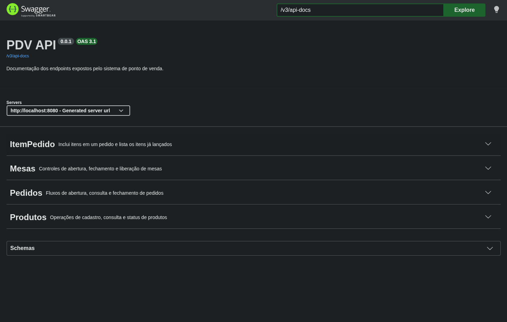

# PDV API


## 🚀 Sobre o Projeto

API REST de um sistema de Ponto de Venda (PDV), responsável por gerenciar produtos, mesas e pedidos, aplicando regras de negócio relacionadas ao fluxo de atendimento e cálculo de valores.

As responsabilidades da API incluem: 

- gerenciamento de produtos
- criação e controle de mesas com regras de transição de status
- criação e controle de status de pedidos
- adição de itens ao pedido
- registro de vendas
- cálculo de subtotal/total

## Arquitetura e decisões de Projeto

A aplicação segue uma arquitetura em camadas, baseada em MVC:

- Utilização de SQL puro para maior controle sobre queries e entendimento do banco
- Regras de negócio centralizadas na camada Service
- Tratamento de erros com exceptions customizadas
- Controle de estado de entidades com validações explícitas

---

Controller  
↓  
Service (regras de negócio)  
↓  
Repository (acesso ao banco)  
↓  
Database

Principais conceitos utilizados:

- arquitetura REST
- separação de responsabilidades
- DTOs para comunicação da API
- validação de dados
- tratamento de erros

---

## Estrutura do Projeto
```
src
└── main
    └── java
        └── com.store.pdvapi
            ├── controller
            ├── dto
            ├── enumtype
            ├── exception
            ├── mapper
            ├── model
            ├── repository
            └── service
```            

## Tecnologias utilizadas 

- Java 17+
- Spring Boot
- Spring Web
- Jakarta Validation
- Maven
- Swagger / OpenAPI
- Banco de dados relacional

## Funcionalidades

Funcionalidades atualmente implementadas:

### Produtos

- cadastrar produto
- listar produtos
- buscar produto por id

### Pedidos

- criar pedido
- consultar pedido
- alterar status do pedido

### Itens do Pedido

- adicionar item ao pedido
- definir quantidade e preço
- cálculo automático de subtotal

---

## 💻 Como executar o Projeto

## Pré-requisitos

Antes de executar o projeto, certifique-se de ter instalado:

- Java 17+
- Maven
- PostgreSQL
- Git

---

## 1. Clone o repositório

``` bash
git clone https://github.com/lucas-luch/pdv-api.git
cd pdv-api
```

---

## 2. Configuração da aplicação

O projeto possui um arquivo de exemplo com as configurações da aplicação.

Copie o conteúdo do arquivo:

`src/main/resources/application.properties.example`

para:

`src/main/resources/application.properties`

Depois ajuste as configurações conforme seu ambiente, como:

- credenciais do banco
- porta da aplicação
- outras configurações necessárias

---

### 3. Configuração do banco de dados

Crie um banco no PostgreSQL:

```sql
CREATE DATABASE pdv;
```

Execute o script de configuração disponível em:

scripts/create-schema.sql
```bash
psql -d pdv -f scripts/create-schema.sql
```

Esse script é responsável por:

- criar o schema da aplicação
- criar tabelas
- definir permissões necessárias

## 4. Executar a aplicação

Execute o projeto com o Maven Wrapper:
``` bash
./mvnw spring-boot:run
```
ou com Maven instalado:
``` bash
mvn spring-boot:run
```
---

## 5. Acessar a aplicação

A API ficará disponível em:

http://localhost:8080

## 6. Documentação da API

A documentação da API está disponível via Swagger:

`http://localhost:8080/swagger-ui.html`


<p align="center">
  
</p>

